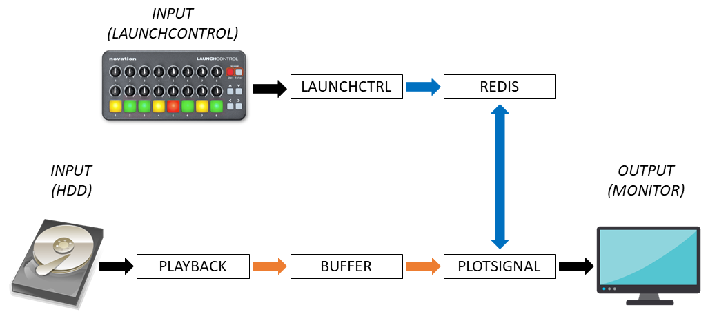

# Tutorial 2: Using Redis for live interaction with modules

After we set up a basic minimal pipe-line with data transfer in [Tutorial 1](tutorial1.md), we can introduce communication between modules using the Redis database. Redis is the place where modules communicate via 'key-value' pairs. Read the [online documentation](http://www.ouunpo.com/eegsynth/?page_id=514) on the EEGsynth website for more background on the use of Redis. In this tutorial we will influence the behavior of the plotsignal output module, by changing parameters in Redis, while having the plotsignal module use these parameters as well as writing parameters back in Redis. It becomes important now to really understand the flow of information in the schema.


_Boxes depict EEGsynth modules. Orange arrows describe time-series data. Blue arrows describe Redis data_

## Writing and reading from Redis

After installation of the EEGsynth, the Redis database should be running in the background at startup. To check whether Redis is working you can monitor Redis while adding and reading 'key-value' pairs. For the purpose of the tutorial we will use the LaunchControl MIDI controller to enter values from the LaunchControl to Redis. If you do not have a Launchcontrol, you can enter values by hand. We will discuss this as well (just skip this part).

1.  Navigate to launchcontrol module directory _/eegsynth/module/launchcontrol_
2.  Copy the _launchcontrol.ini_ to your own ini directory (e.g., to _/eegsynth/myfirstpatch_, which would be in
    _../../myfirstpatch_ relative to the launchcontrol module directory)
3.  Start up the launchcontrol module, using your own ini file:
    `python launchcontrol.py -i ../../myfirstpatch/launchcontrol.ini`
4.  You will see the connected MIDI devices printed in the terminal. If you have not set up the .ini
    file correctly yet, read out the MIDI device name from the output, and replace the device name, e.g.
    `device=Launch Control` under the `[midi]` field of your .ini file.
5.  Now restart the launchcontrol module. If everything is working correctly, a move of any of the
    sliders will print a key-value pair in the terminal.

You can also add values to Redis directly in Python:

1.  Start up Python, i.e. type `python` in the terminal
2.  Import Redis, i.e. type `import r as Redis`
3.  Set a key-value pair, by typing `r.set('test_key','10')`
4.  Read a key-value pair, by typing `r.set('test_key')`

## Patching the plotsignal module

You can now monitor the actions of Redis by opening a new terminal window and running `redis-cli monitor`.  You should be able to see both _set_ and _get_ actions. So monitor this window while adding values in Redis as described above to see if it is working correctly. If you are using the launchcontrol module, you will see that the keys will be named something like _launchcontrol.control077_.  We can tell the plotvisual module to use these values to adapt its behaviour. It will then take these values and relate them to the range of its spectral analysis, to determine frequency bands of its 'red band' and 'blue band'. The plotvisual module, in its turn, will output these frequency bands back into Redis. This makes them available to e.g., further EEG analysis. Take a moment to consider this pipeline. We call this connecting of modules via Redis parameters 'patching', referring to patching in modular synthesizers.

First determine which launchcontrol sliders/rotators you want to use by moving them and looking at the values that change in Redis (use `redis-cli monitor`). Let's say we will do the following:

- launchcontrol.control013 will determine the center frequency of red band
- launchcontrol.control029 will determine the half-width of red band
- launchcontrol.control014 will determine the center frequency of blue band
- launchcontrol.control030 will determine the half-width of blue band

Then edit your _plotsignal.ini_ file to enter these as parameters as follows under `[input]`:

```
redfreq=launchcontrol.control013
redwidth=launchcontrol.control029
bluefreq=launchcontrol.control014
bluewidth=launchcontrol.control030
```

The plotsignal module will now look into Redis to try to find values there corresponding to the status of these keys.  If you now change the value of any of these key-value pairs by e.g., rotating a button, the LaunchControl module will update these values in Redis, where the plotsignal module will read them and adjust its display (the red and blue lines delineating the two frequency bands).  You can now move the frequency bands around, and get visual feedback overlayed on the spectrum of the channels that you are plotting. The plotsignal module also makes a conversion between the state of the values it reads from Redis (the last read position of the knobs), to frequencies in Hertz. It outputs those back into Redis, e.g., under _plotsignal.redband.lo_, and _plotsignal.redband.hi_. You can check this by using `redis-cli monitor`.

_Continue reading: [Tutorial 3](tutorial3.md)_
