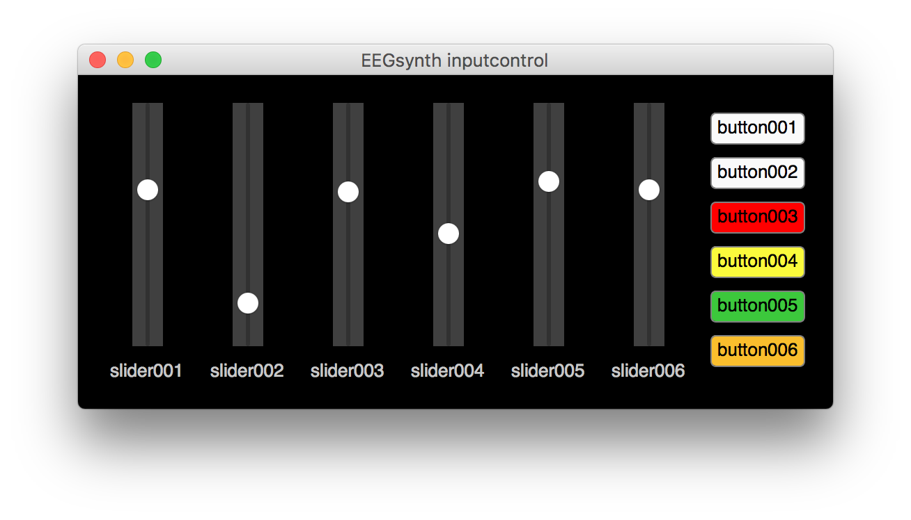

# Inputcontrol

This module presents a graphical user interface (GUI) with a configurable number of sliders and buttons. It can be used as an alternative to a hardware MIDI controller such as the Novation LaunchControlXL. The values of the sliders are sent as control signals to the Redis buffer. The button press and release events are sent as triggers to the Redis buffer.

For the buttons you can specify whether they should respond as push buttons (on/off) or as toggle buttons.

For the buttons you can specify whether they should respond as push buttons (on/off), slap buttons (not responding to off) or as toggle buttons. While push buttons are momentary, i.e. only "on" while you keep your them depressed, toggle buttons retain their state after you release them, pressing once more switches to the next state. The following options are supported, which are also represented using the color code of the LED:

  * toggle1 buttons switch between on-off
  * toggle2 buttons switch between on1-on2-off
  * toggle3 buttons switch between on1-on2-on3-off
  * toggle4 buttons switch between on1-on2-on3-on4-off

The resolution of the sliders and buttons is the same as for MIDI controllers, i.e. in steps from 0 to 127. The scale and offset parameter are applied to prior to sending the output values to Redis.
